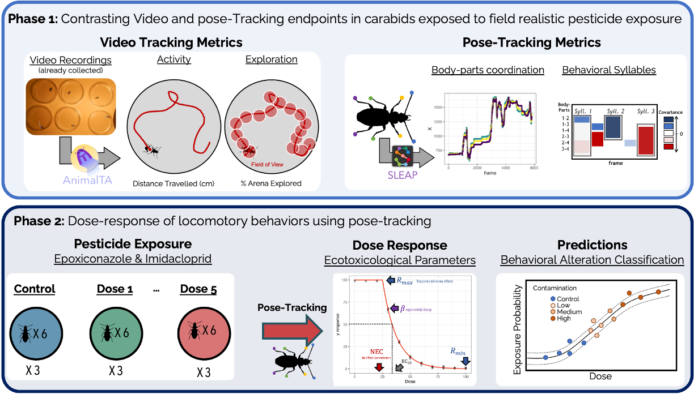

I have a 12-month fully-funded postdoctoral position within [UMR EcoSys](https://ecosys.versailles-saclay.hub.inrae.fr/collaborer-avec-nous/nous-rejoindre/offres-d-emploi-et-post-doc/offre-de-post-doc-en-ecotoxicologie-comportementale) to work on AI models for detecting behavioral indicators of generalist predators exposed to pesticides. The successful candidate will make use of an already-collected dataset of carabid exposed to a pesticide gradient for comparing the outcomes of classical indicators of carabid activity (distance moved and percent of arena explore) with pose-tracking approaches that train AI models to detect the motion of different body-parts. In a second phase, you will lead behavioral ecotoxicity assays to determine whether pose-tracking allows for detecting toxicity parameters (NEC and EC50) at lower concentration compared to classical behavioral indicators.

Feel free to reach out to me for more information or download the full offer [here](ECOSYS_postdoc_behavioral ecotoxicology_FR_EN.pdf).

### Eligibility
- No nationality restrictions
- Must have completed the PhD no later than fall 2022 (position subject to 3-years post-PhD rule as per French regulations)

## Application
Please submit your CV and cover letter to Colette Bertrand (*colette.bertrand@inrae.fr*) and myself (*raphael.royaute@inrae.fr*) no later than October 15th. Applications will be reviewed immediately until the position is filled

## Salary range and benefits
- Anticipated start date: Novembre 2025
- Gross salary of ~ 3100 €
- Full benefits including health care and holidays 
