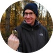
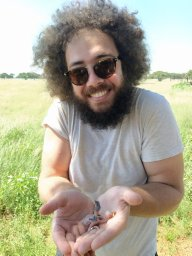
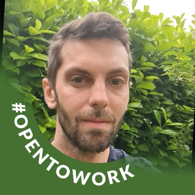
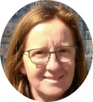

  

## Principal Investigator

:::: {layout="[ 40, 60 ]"}
::: {#first-column}

:::

::: {#second-column}
### Raphaël Royauté
Background: Behavioral Ecology, Evolutionary Ecology, Ecotoxicology

Position: Researcher in Ecotoxicological Modeling

Links:
[INRAE Website](https://www6.versailles-grignon.inrae.fr/ecosys/Personnes/Personnel-Sol-Tox/Scientifiques-Sol-Tox/ROYAUTE-Raphael), 
[GitHub](https://github.com/rroyaute), 
[GitLab](https://forgemia.inra.fr/rroyaute), 
[Email](mailto:raphael.royaute@inrae.fr)
:::
::::

---

  

## Current

:::: {layout="[ 40, 60 ]"}
::: {#first-column}
{width="120px"}
:::

::: {#second-column}
### Nicolas Silva (Postdoctoral Researcher)
Nicolas works on AI-assisted video monitoring for detecting behavioural shifts in ground beetles exposed to pesticide. His background is in behavioural ecology and sexual selection.  

Background: Behavioural Ecology and Bioinformatics

Project: [Behavioral ecotoxicology](../projects#BehavEcotox) 

Co-supervisor: [Colette Bertrand (EcoSys)](https://www6.versailles-grignon.inrae.fr/ecosys/Personnes/Personnel-Sol-Tox/Scientifiques-Sol-Tox/BERTRAND-Colette)

:::
::::

---

  

:::: {layout="[ 40, 60 ]"}
::: {#first-column}
{width="120px"}
:::

::: {#second-column}
### Quentin Devalloir (Postdoctoral Researcher)
Quentin has an MSc in conservation biology with a focus on ecotoxicology. His PhD research focused on how multiple stressors (pollution, nutritional quality) impact the immune response of free-ranging rodents. His research merges experimental, field-based approaches along with mechanistic modeling at the landscape scale to understand the response of wild animals to pollution. His current scientific interests are centered around developing new approach methodologies (NAMS) for the use of animals in scientific research and risk assessment. His project focuses on the modeling of pesticide fate and their impact on biodiversity in vineyard landscapes.

Background: Spatial and Immuno-Ecotoxicology

Project: [Spatially-explicit modeling of pesticide fate](../projects#SpatialTox) 

Co-supervisors: [Carole Bedos (EcoSys)](https://www6.versailles-grignon.inrae.fr/ecosys_eng/Staff/Personnel-Eco-Phy/Scientifiques-Eco-Phy/BEDOS-Carole)

Collaborators: [Colette Bertrand (EcoSys)](https://www6.versailles-grignon.inrae.fr/ecosys/Personnes/Personnel-Sol-Tox/Scientifiques-Sol-Tox/BERTRAND-Colette) [Cécile Dagès (LISAH)](https://www.umr-lisah.fr/?q=fr/content/c-dages), [Pierre Benoit (EcoSys)](https://www6.versailles-grignon.inrae.fr/ecosys_eng/Staff/Photos-and-CV/B/BENOIT-Pierre), Olivier Crouzet (OFB), Pierre-François Staub (OFB)

:::
::::

---

  

:::: {layout="[ 40, 60 ]"}
::: {#first-column}

:::

::: {#second-column}
### Lisa Gollot (PhD Student)
Lisa has a background in environmental chemistry and agronomy. Within the course of her MSc studies in ecotoxicology at [AgroParisTech](https://www.agroparistech.fr/en), she joined our team for a 6-month internship focusing on the modeling of individual differences in earthworm growth under different pesticide exposure regimes.  She has started her PhD with us in October 2023 on similar topics.

Background: Analytical Chemistry, Ecotoxicology

Project: [Eco-evolutionary dynamics](../projects#EEWORMS) 

Co-supervisors: [Rémy Beaudouin (INERIS)](https://umr-sebio.fr/personnel/remy-beaudouin), [Juliette Faburé (EcoSys)](https://www6.versailles-grignon.inrae.fr/ecosys/Personnes/Personnel-par-ordre-alphabetique/F/FABURE-Juliette)
:::
::::

---

  

## Technical staff
:::: {layout="[ 40, 60 ]"}
::: {first-column}

:::

::: {second-column}
### Antoine Bamière
Antoine is an Assistant Engineer in soil fauna and is in charge of arthropod rearing in our research unit. He also assists with fieldwork and experimental projects dedicated to the ecotoxicology of soil organisms.

Links: [INRAE Website](https://www6.versailles-grignon.inrae.fr/ecosys/Personnes/Personnel-Sol-Tox/Ingenieurs-Sol-Tox/BAMIERE-Antoine)

:::
::::
---

:::: {layout="[ 40, 60 ]"}
::: {first-column}

:::

::: {second-column}
### Véronique Etiévant
Véronique is Technician in soil fauna and is in charge of is in charge of earthworm rearing in our research unit. She also assists with fieldwork and experimental projects dedicated to the ecotoxicology of soil organisms.

Links: [INRAE Website](https://www6.versailles-grignon.inrae.fr/ecosys/Personnes/Personnel-Sol-Tox/Techniciens-Sol-Tox/ETIEVANT-Veronique)
:::
::::
---

  

## Past students
Cheikh Sarr (MSc, 2025-26), Luc Imbert (BSc, 2024-25), Alban Royné (MSc, 2024), Clara Laborczy (BSc, 2023-24), Lisa Gollot (MSc, 2023) Perrine Legrand (MSc, 2023), Magali Dahirel (MSc, 2022)